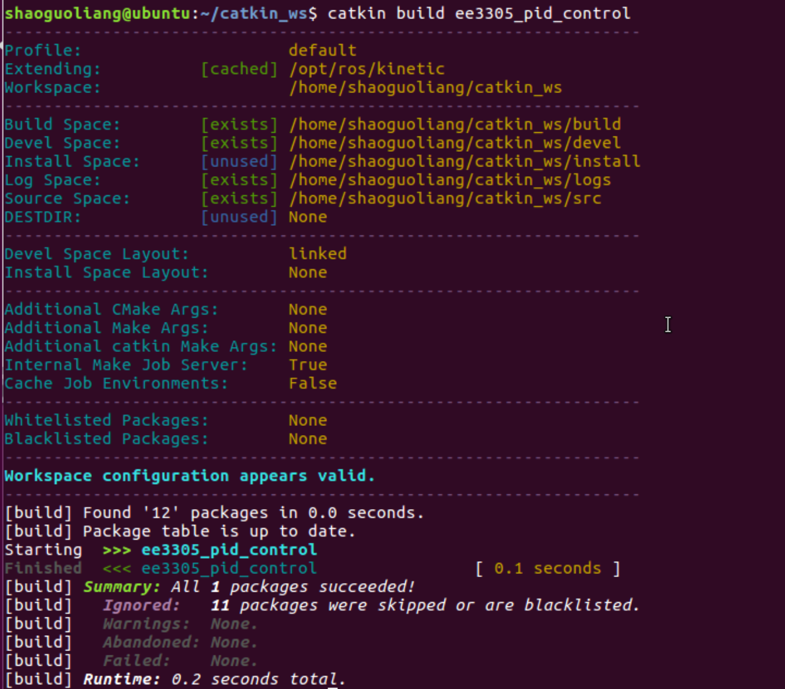
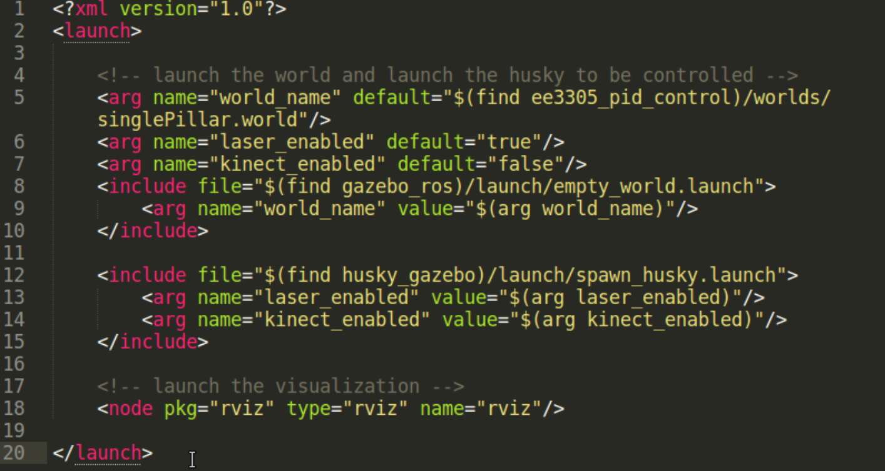
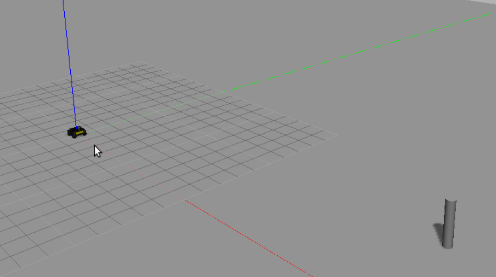
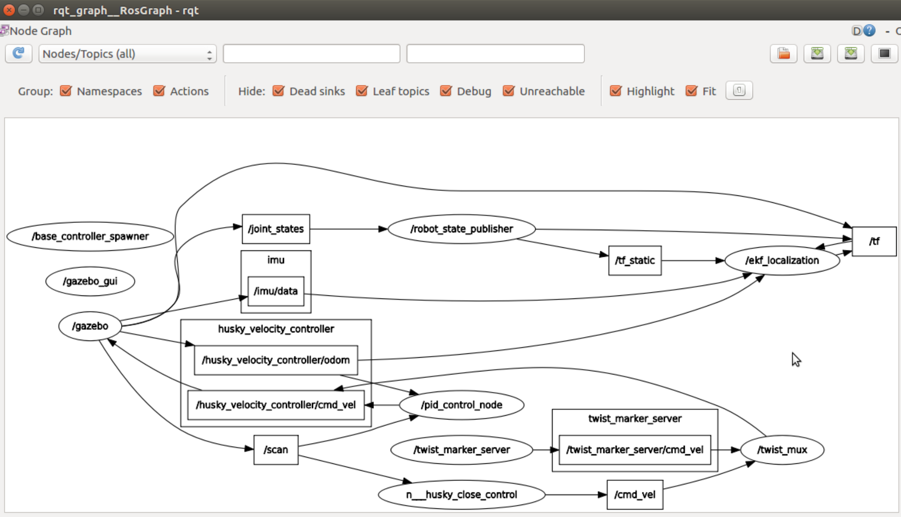
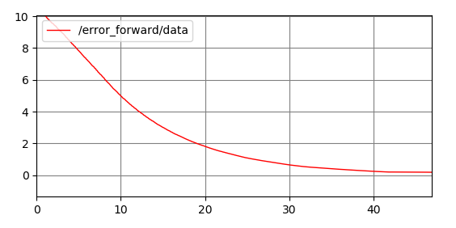
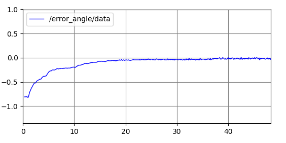

### EE3305 Experiment 1: PID Control
---

Useful Materials: <https://rsl.ethz.ch/education-students/lectures/ros.html>

#### Problem Statement
In this lab, you are required to perform a simulation in the following situation:

* A robot is put at the original position (0, 0).
* A target (a pillar) is put at the target position (X, Y).
* Implement a PID Controller to make the robot reach the target with a certain distance. The PID Controller subscribes the laser scan data to evaluate the position error, and publishes the next velocity parameter. 

#### Environment Required
1. Install ROS: follow the WiKi steps
2. Install catkin: follow the WiKi steps
3. Install husky simulator:

    <http://wiki.ros.org/husky_gazebo/Tutorials/Simulating%20Husky>
    `sudo apt-get install ros-<distro>-husky-simulator` change the <distro> to your ROS version.
    * The package will be installed under the default dir of ROS.
    * Check whether you can find the package husky_gazebo: `rospack list | grep husky`
    * Try to launch the husky using one of the example launch file: `roslaunch husky_gazebo husky_empty_world.launch`
    * Check the nodes currently running. Check the topics and msgs currently published. Using cmd `rostopic list`, `rostopic info [topic_name]`, `rostopic echo [topic_name]`, `rosmsg info [msgs_name]`
    * The laser scan data input is provided with `/scan` topic. To control the robot, publish on the `/husky_velocity_controller/cmd_vel` to configure the velocity.
    * Check the msgs definition, and the topics content.

    **[Q1]** Please find out the angle range (in degree), angle scan increment of the laser scan data. How can you find the distance and orientation of the pillar (under the coordinate system of the robot)?
    
#### Task Goal
##### Step 1: Familiar with ROS operation:
##### 1.1. create a catkin package
    
* Create a source file folder `~/ROSLearning`
* cmd `catkin create pkg pid_control`
* A folder `pid_control` will be generated, with two files `CMakeLists.txt` and `package.xml`
* Create a soft link in `~/catkin_ws/src` using cmd `ln -s [source_dir]`. So that you don't change anything in catkin_ws project, rather you write your code in your source folder.
* You can build your package using cmd `catkin build [package_name]`. It is suggested to use build command rather than make command. You can also use cmd `catkin clean` to remove the previously generated file from the `catkin_ws/src`. After using the `catkin build` command, the project folder is like:

```
|-- catkin_ws
    |--src : to include your source code
    |--devel : generated settings, no touch
    |--build : generated build files, no touch
    |--logs : log file
```



##### 1.2. know the CMakeLists.txt

From <https://rsl.ethz.ch/education-students/lectures/ros.html>

The `CMakelists.txt` controls the build process of your source code. So you need to make changes as you add source file into your project. The first goal is to generate the world and the robot you want to control. This can be done by adding the related module in the launch file.  

##### 1.3. know the package.xml
The `package.xml` defines the properties of the package, especially the dependencies required to performing your node.

You can find all the built-in ros package using the cmd `rospack list`. Do remind that if the `rospack list` does not find the package you created, it is because you haven't include the path to `$ROS_PACKAGE_PATH`. You can check the path using cmd `echo $ROS_PACKAGE_PATH`, if you can't find the directory in your `catkin_ws/src`, you need to update the setup through:

```
catkin_ws/devel $ source setup.bash
```

##### 1.4. generate a world and a robot
Launch file is a tool to start multiple nodes as well as setting parameters. A launch file is written in xml as `*.launch`.

Create a `launch` folder in you source directory, and create a launch file `pid_control.launch` as follows.



So the above launch file, we include a world with directory `$(find ee3305_pid_control)/worlds/singlePillar.world`. `$(find ee3305_pid_control)` is shell cmd same as `rospack find ee3305_pid_control`. Create a worlds folder in your src directory and import the world file provided. A robot model is also included with directory `$(find husky_gazebo)` check this package by yourself. In the end we add a node to visualise the world and the robot.

First, start the roscore to manage all the system. cmd `roscore`, and leave it in an independent window.

Launch all the nodes using cmd `roslaunch [pkg_name] [launch_file_name]` or find the launch file directory cmd `roslaunch [launch_file_name]`.


    
##### 1.5. check the topics published
* Use `rostopic list` to view all the topics
* Use `rostopic echo [topic_name]` to view the msgs in the topic
* Use `rostopic type [topic_name]` to view the type of msgs of the topic
* Use `rostopic show [topic_name]` to view how the msgs are define (the structure of the msgs)

Check the topic on `/scan` and `/husky_velocity_controller/odom`.

#### Step 2: Create your node with pid control

Before you create your algorithm node, your project file should be like this:

```
|--pid_control
    |--worlds : contains the singlePillar world 
    |--launch : contains the launch file
    |--CMakeLists.txt
    |--package.xml
```

##### 2.1 Create your node

1. Create the `src` folder (store your processing code) and the `include` folder (store your header code)
2. Creating your code as provided
3. **Modify the CMakeLists.txt and package.xml**
    The compile procedure:
    
    
    ```
    CMakeLists.txt
    -- find_package : tell catkin to find the required packages, 
    -- catkin_package : add include_dirs, libraries, catkin_depends, depends
    -- add_executable : tell catkin the file you want to create the executable object
    -- target_link_libraries : link the relevant object file
    
    package.xml : indicate the dependencies your package required. 
    ```
    
4. **Modify the launch file**
Add `<node>` tag
`<node pkg="pkg_name" type="executable_name" name="node_name" output="screen">`
pkg_name: The name when you use catkin create pkg
executable_name: The name in CMakeLists.txt add_executable
node_name: The name when you initialize a node using ros::init("node_name")

5. `roslaunch` your launch file, and check the node has been launched. Use `rqt_graph` to check the topics that connects all the nodes.

    

6. Use `rqt_plot` to show the error in a new terminal window.



7. Change the gain of PID control in config.yaml, and check the difference.

* Why do you need a config file? In PID control, you have some parameters to tune to achieve a good performance. Traditionally, the parameters are defined in the code, then once you change the parameter, you have to compile and build again. However, if you use a config file, your algorithm will first load the parameters from the config file when initializing the node rather than compile the code again.
* config.yaml is just a text file, using `name: value` pair to indicate the parameters.
* In your code, use the following example:

    ```
    if(!nodehandle_.getParam("/Kp_f", Kp_f)){
    		ROS_ERROR("Kp_f Load Error");
    		return false;
    }
    ```


