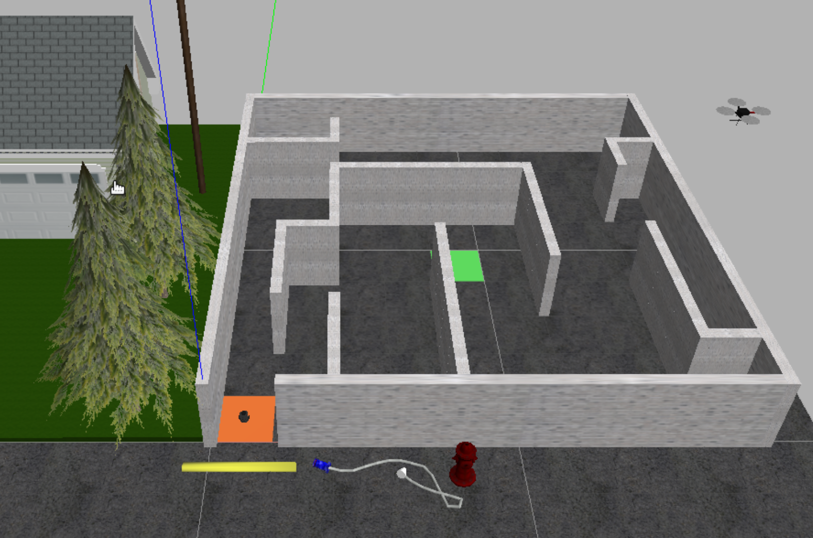

### EE3305 Experiment 2： Path planning in a maze
---

#### Problem Statement
In this lab, you are required to perform a simulation in the following situation:

* A robot is put at the original point (0, 0) in a 2D predefined maze. 
* The robot has no knowledge of the maze.
* The robot is provided with a laser scan and an odometry data input.
* Given the target coordinate, move the robot to the target position while avoid hitting the wall.

#### Environment Required
1. Install turtlebot3 package:
    `sudo apt-get install ros-[ros_version]-turtlebot-*`
    * The package will be installed under the default dir of ros
    * Check whether you can find the turtlebot3_gazebo: `rospack list | grep turtlebot3`
    * Try to launch the turtlebot3 using one of the example launch file. `roslaunch turtlebot3_gazebo launchfile.launch`
    * There should be an error indicating you need to configure the turtlebot3 model by adding an environment variable. Here we use the "burger". `export TURTLEBOT3_MODE="burger"`.
    * Check the nodes currently running. Check the topics and msgs currently published. Using cmd `rostopic list`, `rostopic info [topic_name]`, `rostopic echo [topic_name]`, `rosmsg info [msgs_name]`.
    * The laser scan data input is provided with `/scan` topic. The odometry data input is provided with `/odom` topic. The to control turtlebot, publish on the `/cmd_vel` to configure the velocity.
    * Check the msgs definition, and the topics content.

    **[Q1]** Please find out the angle range (in degree), angle scan increment, and find out the direction of the 0, 1/4\*data_size, 1/2\*data_size data point with respect to the robot coordinate system.
    
    **[Q2]** Please find out how the odometry information is defined, and write down the equation of transforming the odometry data to position and euler angle under the world coordinate system. (Given that the robot will not have z direction movement nor rotation along x axis and y axis.)

2. If you get some errors when launching the environment, update gazebo9. Find it in Trouble Shooting.

3. Launch the turtlebot in the predefined maze. The maze file is provided in under `/worlds/test_world_1.world`.

    * Write your launch file. (This can be done by changing the world file in previous example launch file)
    * Write shell to configure the robot initial orientation and position. Note that, in ubuntu, after you write down a shell program, you need to configure it as a executable file before you can run it. You can use `ls -ll` to find out the current state of your file. You can use `chmod 777 file.sh` to guarantee a file with 777 permission(read (r), write (w) and execute (x)).
    * The launch environment should be as follows:


    


#### Structure Design

The task can be broken down into three parts: first, the robot needs to get the information of the map, specifically, where are the walls; second, the robot needs to find the shortest path heading based on the current map information, which can be performed using dijkstra algorithm or other path finding algorithm, and the robot needs to decided where is the next heading target at the current position; third, the robot needs to implement a pid control to move itself steadily towards the heading target. This process will go over and over again until the robot reaching the final target. Each part can be written as a node.

##### 1. Perception Node
This node is input with the laser scan data and the odometry data to detect the wall within the current cell. Pass the detected range to decision making node. 

**[Q3]** Because the laser scan data is taken under the robot coordinate system, the map needed to be construct is under the world coordinate system. Given the odometry information and the laser scan data, how can you find out whether this is a wall in North, South, East, or West of the current cell the robot locates at. Please write down the equation.


##### 2. Decision Node
* Maintain and update the map of the maze using the wall detection from Perception Node and localization from Odometry. 
* Using Dijkstra Algorithm to find the path with minimum length to the target. 
* Decide the next cell the robot needs to heading. Pass the decision (the next heading target) to Control Node.

##### 3. Control Node
Receives next heading cell from the decision node. Use PID Control to stabilize the robot movement.

#### Example Steps:
##### 1. Build the example package using catkin
##### 2. Launching the environment
```
cd ee3305_path_plan_v2/bin
./melodic_project_init_world_1.sh
```
And wait until the gazebo shows the maze and the robot

##### 3. Launching all the nodes
```
roslaunch ee3305_path_plan_v2 start_all_nodes.launch
```

#### Trouble shooting in melodic

When installing the turtlebot3 package, there might be some situation occurs. Here are some trouble shooting solutions:

1. **[Problem]**There are a lot of pkgs showing error "can not find resources"
**[Ans]** <https://answers.ros.org/question/325039/apt-update-fails-cannot-install-pkgs-key-not-working/>
This is because we are using the old public key to fetching the updated resource. We need to update the public key.

2. **[Proble]**Gazebo crashing when launching the navigation node
**[Ans]** <https://stackoverflow.com/questions/55181205/gazebo-crashing-when-subscribing-to-scan>
This should be gazebo version problem. Update the gazebo 7 should be good.
Just update gazebo using `sudo apt-get upgrade gazebo9`

3. **[Error]**E: Could not get lock /var/lib/dpkg/lock-frontend - open (11: Resource temporarily unavailable)
E: Unable to acquire the dpkg frontend lock (/var/lib/dpkg/lock-frontend), is another process using it?
**[Solution]** Type all the following cmds to fix the problem.
sudo killall apt apt-get
sudo rm /var/lib/apt/lists/lock
sudo rm /var/cache/apt/archives/lock
sudo rm /var/lib/dpkg/lock*
sudo dpkg --configure -a
sudo apt update

4. **[Error]** libcurl: (51) SSL: no alternative certificate subject name matches target host name 'api.ignitionfuel.org'
**[Solution]** You need to change ~/.ignition/fuel/config.yaml as following.
    `url: https://api.ignitionfuel.org`
to
    `url: https://api.ignitionrobotics.org`
    
5. **[Error]** gazebo has died when launching the gazebo.
**[Solution]** Terminate the current process and restart the gazebo again.

