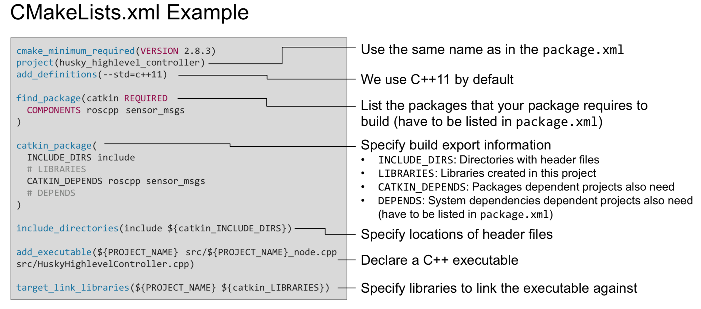

### EE3305 Exercise: Talker and Listener
---

#### 1. Learning Outcomes
* Understand the `msg` and `topic` in ROS
* Creating your nodes to achieve one-way communication between talker and listener
* Build your nodes using catkin work space, use CMake to manage the building of your code
* Involving `roslaunch` to activate the nodes

#### 2. Understand msg and topic
* The communication between ROS nodes are conducted through the ROS topics. 
* Node A needs to send the information to other nodes, then Node A is called a publisher. The information is called ROS topic, i.e. Student A wants to send some information to others through Email, in this case, Email is called 'topic'. Similarly, WhatsApp can be called another 'topic'.
* Node B wants to receive the information sent from Node A, then Node B is called a subscriber. The first thing Node B needs to do is to subscribe the 'topic', as in, Student B must have an Email account to receive the information. 
* The information conveyed by the 'topic' is 'message'. For example, Node A wants to publish "I found 3 people in location 1", which is a 'message'. However, if Node A keeps publishing the same pattern information, the text is redundant. Instead, Node A will just publish '3 1'.
* msg file defines the meaning of '3' and '1'. msg files are simple text files that describe the fields of a ROS message [from official tutorial]. As stated above, msg file actually defines the data structure of the message conveyed through topic. 

##### Task:
1. `roscore` to run the ROS master
2. `rostopic list` to find all the topics managed by ROS
3. `rosmsg show sensor_msgs/LaserScan` to find how the LaserScan message is defined. The source dir of this msg file is `/opt/ros/melodic/share/sensor_msgs/msg/LaserScan.msg`
4. `rosmsg show std_msgs/String` to find how the standard string information isi defined. Find out the source dir by yourself.

#### 3. Creating your nodes of talker and listener
#####1. create a catkin work space:
```
cd ~
mkdir -p catkin_ws/src
cd ~/catkin_ws
catkin build
```
wait for build success

##### 2. create your package:
```
cd ~/catkin_ws/src
catkin create pkg ee3305_TL
```
a source folder named `ee3305_TL` will be generated with CMakeLists.txt and package.xml in it.
    
##### 3. write your talker code

```
cd ~/catkin_ws/src/ee3305_TL
mkdir src
cd ~/catkin_ws/src/ee3305_TL/src
```
generate your source code directory and put your code in it.
    
Talker code:
    
```c++
#include "ros/ros.h"
#include "std_msgs/String.h"

#include <sstream>

int main(int argc, char **argv)
{
  //You node is activated by this init function, "talker" is your node_name
  ros::init(argc, argv, "talker");

  //Create a nodehandle, all the operations are through the node handle
  ros::NodeHandle n;

  //Define the publisher topic, topic name "chatter", msgs type "std_msgs/String", publish buffer size 1000
  ros::Publisher chatter_pub = n.advertise<std_msgs::String>("chatter", 1000);

  //Define the frequency (Hz) to wake up your node and do something
  ros::Rate loop_rate(10);

  int count = 0;
  while (ros::ok())
  {

    std_msgs::String msg;

    std::stringstream ss;
    ss << "hello world " << count;
    msg.data = ss.str();

    //Log, this is hard code in the screen, not the real message
    ROS_INFO("%s", msg.data.c_str());

    //Here, the message is actually sent out
    chatter_pub.publish(msg);

    ros::spinOnce();

    loop_rate.sleep();
    ++count;
  }


  return 0;
}
```
    
Modify your CMakeLists.txt

* `find_package(catkin REQUIRED roscpp std_msgs)` list the required package
* `catkin_package(CATKIN_DEPENDS roscpp std_msgs)` specify build information
* `include_directories(${catkin_INCLUDE_DIRS})` specify the location of headers
* `add_executable(talker_node src/talker_node.cpp)` declare an executable object
* `target_link_libraires(talker_node ${catkin_LIBRARIES})` link the libraries after assembly



Modify your package.xml

* `<depend>roscpp</depend>` add the package dependencies that appears in your CMakeLists.txt
* `<depend>std_msgs</depend>`

##### 4. build your talker node and run your talker node
```
cd ~/catkin_ws
source ./devel/setup.bash
catkin build ee3305_TL
```

* wait for build success
* run your node `rosrun ee3305_TL talker_node`. The pattern is `rosrun [pkg_name] [node_name_executable]`
* you will see the log information started with [INFO]
* open a new terminal, `rostopic list` find out the topic your node just published
* `rostopic echo [topic_name]` to see the real message
* `ctrl + c` to stop the running node

##### 5. write your listener code
Listener Code:

```c++
#include "ros/ros.h"
#include "std_msgs/String.h"

/**
 * This tutorial demonstrates simple receipt of messages over the ROS system.
 */
void chatterCallback(const std_msgs::String::ConstPtr& msg)
{
  ROS_INFO("I heard: [%s]", msg->data.c_str());
}

int main(int argc, char **argv)
{

  ros::init(argc, argv, "listener");

  ros::NodeHandle n;

  //Subscribe the topic 'chatter', with buffer size 1000, Whennever I receive a new message, a function called 'chatterCallback' will be trigged
  ros::Subscriber sub = n.subscribe("chatter", 1000, chatterCallback);
  //Alwayes listening to the topic to see if there is new message come in
  ros::spin();

  return 0;
}
```

* Modify your CMakeLists.txt as in talker node

##### 6. build your listener code and run your listener code
* build you project using `catkin build [pkg_name]`
* wait for the build success
* run your listener node through `rosrun [pkg_name] [node_name_executable]`
* without running the talker node, the topic as no message delivered. So there is nothing on the screen
* run your talker node, and see the log information

#### 4. use launch file to activate all the nodes at the same time
In ROS, the master cannot control which node should be activated first. So all the nodes must be robust to be launched. A launch file makes it possible to activate multiple nodes you need just by configuring one file.

* create a launch folder named 'launch' `mkdir launch`
* add a launch file 'launch_name.launch'
* write your launch file:

```xml
<?xml version="1.0"?>
<launch>
    <node pkg="ee3305_TL" type="talker_node" name="talker" output="screen"/>
    <node pkg="ee3305_TL" type="listener_node" name="listener" output="screen"/>
</launch>
```
`pkg` refers to your pkg_name, `type` refers to the executable name of your node which is in your CMakeLists, `name` refers to the node name defined by the ros::init() in your node code.  

* launch your nodes using `roslaunch ee3305_TL launch_name.launch` the pattern is `roslaunch pkg_name`

You will see all the logs are printed together in one screen. Simply adding `launch-prefix="gnome-terminal --command"` in node tag, you will have a separate window to see the log.

