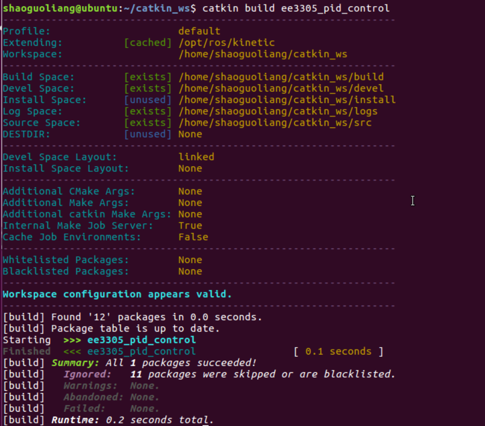
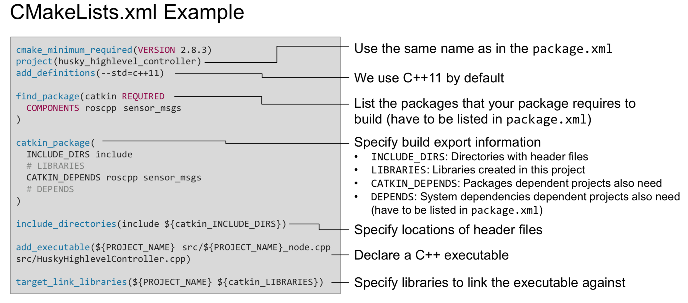
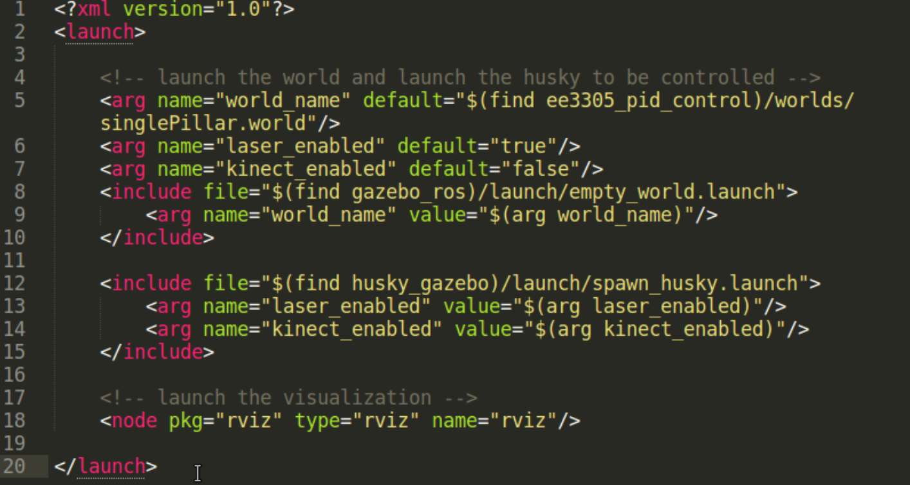
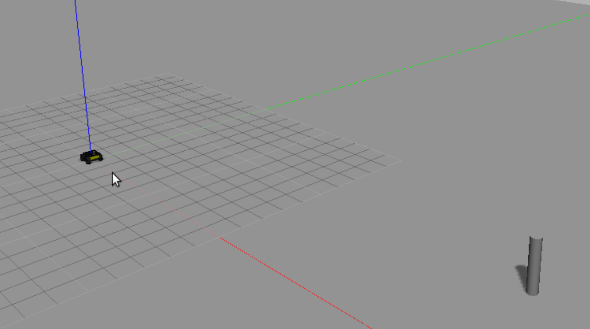
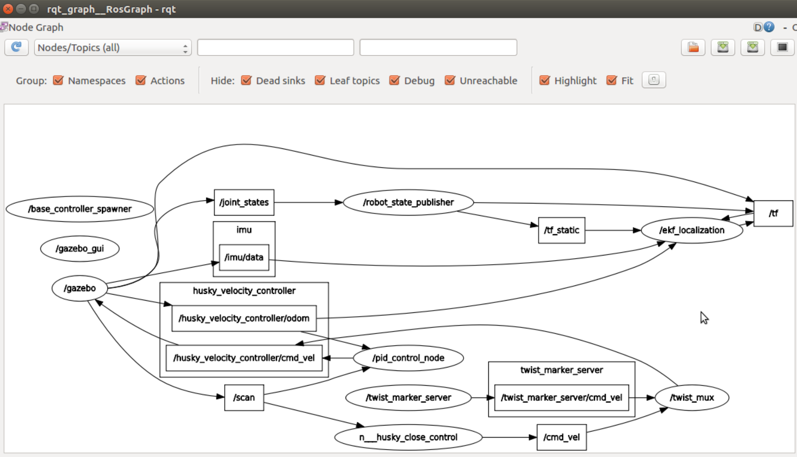

# EE3305 Experiment 1： PID Control

## PreInstallation
#### ROS Installation
Follow the Wiki steps
#### catkin Installation
Follow the Wiki steps

[Note] cmd `catkin build` gives `catkin command not found`
[Ans] The `catkin build` command is part of the catkin_tools package. So additionally install `python-catkin-tools` on `apt-get` 

#### Husky Installation
<http://wiki.ros.org/husky_gazebo/Tutorials/Simulating%20Husky>

`$ sudo apt-get install ros-<distro>-husky-simulator`
run one of the simulator
`$ roslaunch husky_gazebo husky_empty_world.launch`


## Task Goal
### Step 1: Familiar with ROS operation:
#### 1.1. create a catkin package
* Create a source file folder `~/ROSLearning`
* cmd `catkin create pkg pid_control`
* A folder `pid_control` will be generated, with two files `CMakeLists.txt` and `package.xml`
* Create a soft link in `~/catkin_ws/src` using cmd `ln -s [source_dir]`. So that you don't change anything in catkin_ws project, rather you write your code in your source folder.
* You can build your package using cmd `catkin build [package_name]`. It is suggested to use build command rather than make command. You can also use cmd `catkin clean` to remove the previously generated file from the `catkin_ws/src`. After using the `catkin build` command, the project folder is like:

```
|-- catkin_ws
    |--src : to include your source code
    |--devel : generated settings, no touch
    |--build : generated build files, no touch
    |--logs : log file
```



#### 1.2. know the CMakeLists.txt

From <https://rsl.ethz.ch/education-students/lectures/ros.html>

The `CMakelists.txt` controls the build process of your source code. So you need to make changes as you add source file into your project. The first goal is to generate the world and the robot you want to control. This can be done by adding the related module in the launch file.  

#### 1.3. know the package.xml
The `package.xml` defines the properties of the package, especially the dependencies required to performing your node.

You can find all the built-in ros package using the cmd `rospack list`. Do remind that if the `rospack list` does not find the package you created, it is because you haven't include the path to `$ROS_PACKAGE_PATH`. You can check the path using cmd `echo $ROS_PACKAGE_PATH`, if you can't find the directory in your `catkin_ws/src`, you need to update the setup through:

```
catkin_ws/devel $ source setup.bash
```

#### 1.4. generate a world and a robot
Launch file is a tool to start multiple nodes as well as setting parameters. A launch file is written in xml as `*.launch`.

Create a `launch` folder in you source directory, and create a launch file `pid_control.launch` as follows.



So the above launch file, we include a world with directory `$(find ee3305_pid_control)/worlds/singlePillar.world`. `$(find ee3305_pid_control)` is shell cmd same as `rospack find ee3305_pid_control`. Create a worlds folder in your src directory and import the world file provided. A robot model is also included with directory `$(find husky_gazebo)` check this package by yourself. In the end we add a node to visualise the world and the robot.

First, start the roscore to manage all the system. cmd `roscore`, and leave it in an independent window.

Launch all the nodes using cmd `roslaunch [pkg_name] [launch_file_name]` or find the launch file directory cmd `roslaunch [launch_file_name]`.



#### 1.5. check the topics published
* Use `rostopic list` to view all the topics
* Use `rostopic echo [topic_name]` to view the msgs in the topic
* Use `rostopic type [topic_name]` to view the type of msgs of the topic
* Use `rostopic show [topic_name]` to view how the msgs are define (the structure of the msgs)

Check the topic on `/scan` and `/husky_velocity_controller/odom`.

### Step 2: Create your node with pid control

Before you create your algorithm node, your project file should be like this:

```
|--pid_control
    |--worlds : contains the singlePillar world 
    |--launch : contains the launch file
    |--CMakeLists.txt
    |--package.xml
```

#### 2.1. Algorithm

```
Question:
1. In the code provided, the function callback() which use the odometry to receive the orientation.
Why is it ang_z = ori_z * 2.19, given that ori_z is a quaternion?
So, when the robot not turn on x axis and y axis, the quaternion of [w, x, y, z] would be [cos(pitch/2), 0, 0, sin(pitch/2)]. So ang_z (pitch) is almost like 2*ori_z? 
2. The laser scan, it is used the middle point as the range.
3. In the algorithm, the error_angle is calculated by ori_z - target_angle. However, the ori_z is from /odom, which is a measurement of the robot controlling, not the perception measurement. So I use the laser scan data to construct the error_angle.
```

#### 2.2. Create your node
1. Create the `src` folder (store your processing code) and the `include` folder (store your header code)
2. Creating your code as provided
3. **Modify the CMakeLists.txt and package.xml**

    CMakeLists.txt
    -- find_package : add the dependencies
    -- catkin_package : add the dependencies
    -- add_executable : tell CMake the file yous want you create the executable object
    -- target_link_libraries
    package.xml : add the dependencies
    
4. **Modify the launch file**
Add `<node>` tag
`<node pkg="pkg_name" type="executable_name" name="node_name" output="screen">`
pkg_name: The name when you use catkin create pkg
executable_name: The name in CMakeLists.txt add_executable
node_name: The name in when you initialize a node using ros::init("node_name")

5. `roslaunch` your launch file, and check the node has been launched. Use `rqt_graph` to check the topics that connects all the nodes.

    

6. Use `rqt_plot` to show the error.

7. Change the gain of PID control in config.yaml, and check the difference


